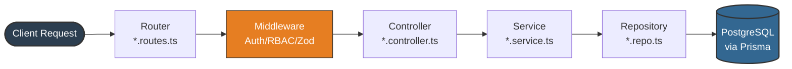
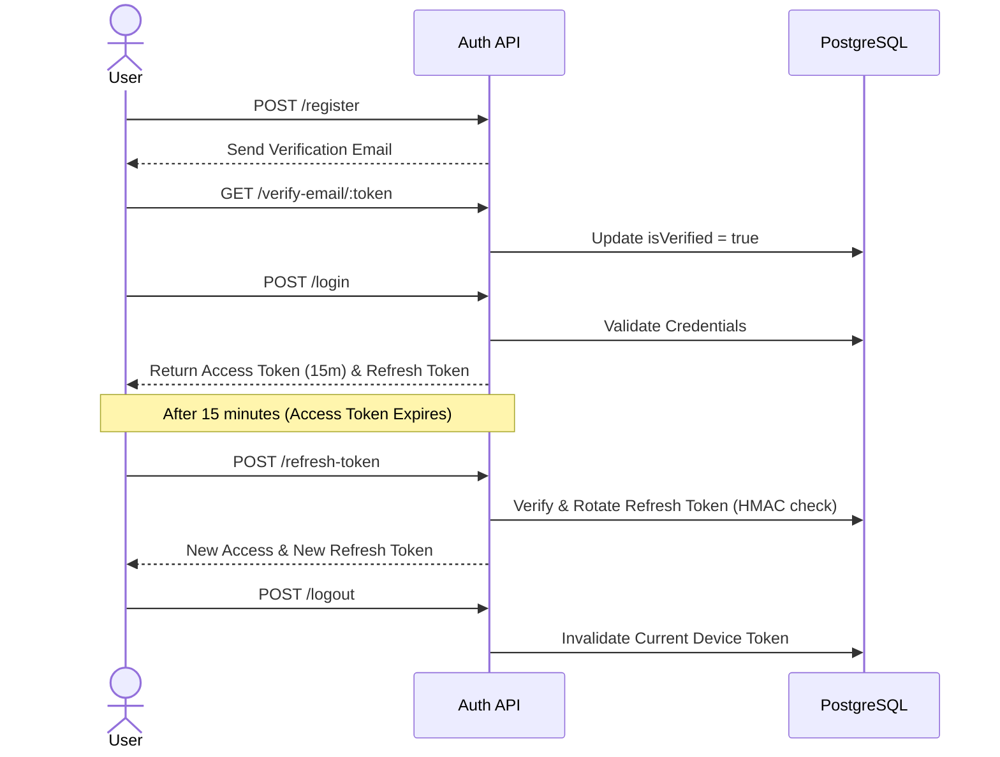
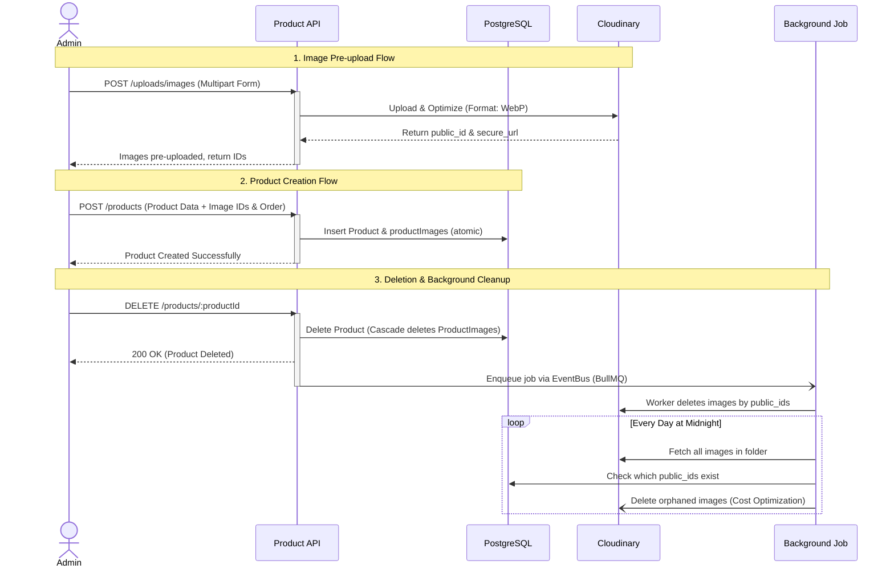
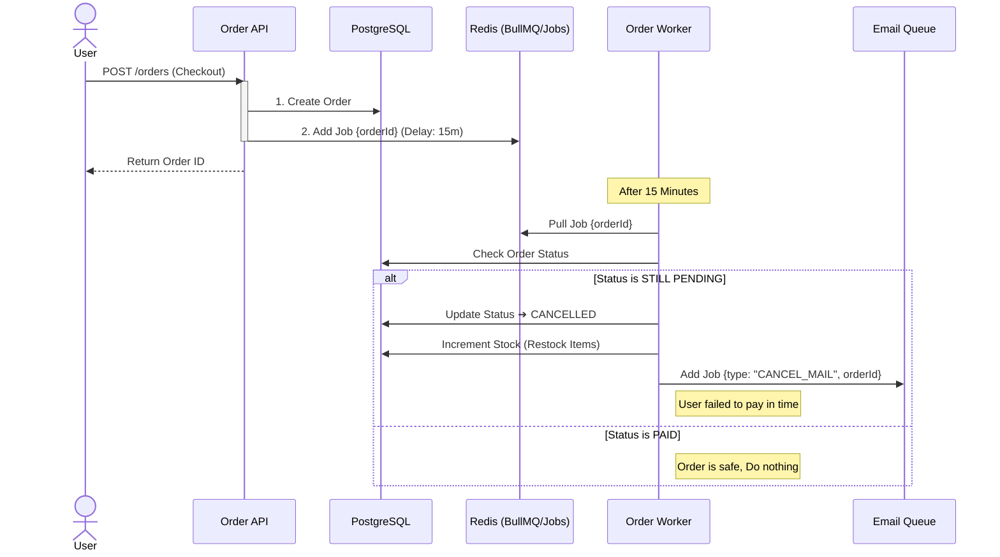

# E-Commerce Backend API

A production-aware RESTful backend for an e-commerce application, built with **Node.js**, **TypeScript**, **Express**, and **Prisma ORM** (PostgreSQL). Designed as a portfolio project to demonstrate professional backend engineering practices.

---

## Table of Contents

1. [Project Overview](#1-project-overview)
2. [Features](#2-features)
3. [Architecture Overview](#3-architecture-overview)
4. [Core Business Flows](#4-core-business-flows)
5. [API Endpoints](#5-api-endpoints)
6. [API Response Format](#6-api-response-format)
7. [Getting Started](#7-getting-started)
8. [Design Decisions](#8-design-decisions)
9. [Future Improvements](#9-future-improvements)
10. [Contact](#10-contact)

---

## 1. Project Overview

This project implements the core concerns of a real e-commerce backend system: stateless JWT authentication with refresh token rotation, role-based access control, a full product catalog with Cloudinary image management, cart and checkout flows with inventory control, Stripe Checkout integration with webhook handling, customer reviews with purchase verification, background cleanup jobs, and an analytics dashboard that aggregates app-wide revenue, customer behavior, and inventory health metrics in a single API call. The goal is to demonstrate a clean, modular, and production-aware codebase — not a toy CRUD app.

**Tech Stack:** Node.js · TypeScript · Express · Prisma ORM · PostgreSQL · Stripe · Cloudinary · Pino · Vitest · Docker

---

## 2. Features

- **Authentication & Security** — JWT & opaque refresh tokens (HMAC-SHA256), session limiting, RBAC (`USER`, `MANAGER`, `ADMIN`), and modular Auth services (`Identity`, `Session`, `Password`).
- **Event-Driven Architecture & Queues** — Decoupled domains via an in-process `EventBus`. Independent worker processes using **BullMQ** & Redis for transactional emails (Brevo/Mailtrap), Cloudinary image operations, order expiration, and reliable background scheduling.
- **E-Commerce Core** — Product catalog, carts, purchase-verified reviews, and atomic checkout transactions (Prisma interactive transactions) with address/price snapshots and Stripe Checkout integration.
- **Performance & Caching** — Short-TTL Redis caching implemented for catalog queries, dashboard stats aggregations, and authenticated user lookups to dramatically reduce database load.
- **Operations & Analytics** — Single-call analytics dashboard (revenue, best sellers, dead-stock), structured Pino logging, Vitest integration tests, and full Dockerization.

---

## 3. Architecture Overview

The project follows a **Modular Architecture** where each domain in src/modules/ is self-contained to ensure isolation. High-latency tasks are decoupled into a standalone Worker Process using BullMQ and Redis for maximum scalability.

**Within each module:**

| File              | Responsibility                                                                                                                                                                         |
| ----------------- | -------------------------------------------------------------------------------------------------------------------------------------------------------------------------------------- |
| `*.routes.ts`     | Express router: maps HTTP verbs to controller methods and attaches middleware                                                                                                          |
| `*.controller.ts` | Handles request lifecycle: performs schema validation (Zod), orchestrates calls to domain services, and transforms the resulting data into a consistent JSend-compliant HTTP response. |
| `*.service.ts`    | All business logic for this domain                                                                                                                                                     |
| `*.repo.ts`       | All Prisma/database queries for this domain                                                                                                                                            |
| `*.validator.ts`  | Zod schemas for request body, params, and query validation                                                                                                                             |
| `*.dto.ts`        | Response shape transformations (e.g., public view vs. admin view)                                                                                                                      |
| `*.query.ts`      | Query engine config: allowed filters, sort fields, selectable fields                                                                                                                   |

**Shared infrastructure** lives in `src/shared/` (email service, token service, security utils) and `src/infra/` (queue client, event bus, Cloudinary, email transport providers). `src/config/` holds validated env config, the database singleton, and the Pino logger.

```
src/
├── app.ts                      # Express app: middleware, route mounting, error handler
├── server.ts                   # API process entry: boots EventBus, queues, subscribers, Bull Board
├── config/
│   ├── env.ts                  # Env validation via Zod-style type guards (getConfig())
│   └── logger.ts               # Pino base logger with redaction and AsyncLocalStorage mixin
├── lib
│   └── prisma.ts             # PrismaClient singleton instance
├── infra/
│   ├── queue/                  # QueueClient (IORedis), QueueFactory, QueueRegistry, WorkerFactory
│   ├── event-bus/              # EventBus singleton (typed Node.js EventEmitter)
│   ├── email/                  # IEmailProvider, MailtrapProvider, BrevoProvider, EmailProviderFactory
│   └── cloudStorage/           # Cloudinary connection and upload helpers
├── shared/
│   ├── tokens/                 # TokenService, TokenRepo, ActionTokenType enum
│   ├── utils/                  # SecurityUtils (SHA-256, HMAC-SHA256, random token generation)
│   └── services/
│       └── email/              # EmailService + typed EJS templates (6 email types)
├── events/
│   ├── event.constants.ts      # EVENT_NAMES grouped by domain
│   ├── event.types.ts          # Typed payload interfaces per event
│   └── subscribers/            # UserSubscriber, OrderSubscriber, PaymentSubscriber, ProductSubscriber
├── workers/
│   ├── worker.server.ts        # Worker process entry point (separate from API)
│   ├── email/                  # EmailWorker + 6 strategy classes
│   ├── image/                  # ImageWorker + Upload/Delete/BulkDelete strategies
│   ├── order/                  # OrderWorker + ExpireOrder/SimulateShipping strategies
│   └── scheduler/              # SchedulerWorker + 5 cleanup strategies; Scheduler (repeatable jobs)
└── modules/
    ├── auth/
    │   └── services/
    │       ├── identity.service.ts   # Registration, email verification
    │       ├── session.service.ts    # Login, JWT, refresh rotation, logout
    │       └── password.service.ts   # Forgot/reset password, bcrypt
    ├── user/
    ├── product/
    ├── category/
    ├── cart/
    ├── order/
    ├── payment/
    ├── review/
    └── address/
```

---

### Request Lifecycle



## 4. Core Business Flows

### Authentication Flow



### Product Management & Media Lifecycle (Admin)

Demonstrates separated media uploads, Cloudinary optimization (WebP), fire-and-forget deletion, and a background cron job to sweep orphaned images for cost optimization.



### Checkout & Payment Flow



---

## 5. API Endpoints

The API is structured around RESTful principles. Core domains include:

- **Auth**: `/api/v1/auth/*` (register, login, refresh, password reset, email verification)
- **Products**: `/api/v1/products/*` (catalog listing, image uploads, management)
- **Orders & Payments**: `/api/v1/orders/*` and `/api/v1/payments/webhook`
- **Dashboard**: `/api/v1/admin/dashboard/stats`

## 6. API Response Format

All endpoints follow a consistent JSend-style JSON response shape:

- **Success**: `{ "status": "success", "data": { ... } }` (includes `pagination` where applicable)
- **Client Error (4xx)**: `{ "status": "fail", "message": "..." }`
- **Server Error (5xx)**: `{ "status": "error", "message": "..." }` (Stack traces included in development only).

---

## 7. Getting Started

### Prerequisites

- Node.js >= 18
- PostgreSQL >= 14, or use the Docker Compose setup
- A Cloudinary account (free tier is sufficient)
- A Stripe account (test mode keys)

### Local Development

```bash
# Clone the repository
git clone https://github.com/Omar3597/ecommerce.git
cd ecommerce

# Install dependencies
npm install

# Copy the example env file and fill in your values
cp .env.example .env

# Apply the schema to your database
npx prisma migrate dev

# (Optional) Seed development data
npm run db:seed:dev

# Start the dev server with hot reload
npm run dev
```

The API will be available at `http://localhost:3000/api/v1`.

### Docker Compose (Recommended)

```bash
# Clone the repository
git clone git@github.com:Omar3597/ecommerce.git
cd ecommerce

# Copy the example env file and fill in your values
cp .env.example .env

# Start the app and a PostgreSQL container
docker compose -f docker-compose.dev.yml up --build
```

The API will be available at `http://localhost:3000/api/v1`.

### Running Integration Tests

```bash
# Runs all integration tests inside a dedicated Docker environment
npm run test
```

Tests use a separate PostgreSQL container defined in `docker-compose.test.yml` and the `.env.test` configuration. The test suite covers all 9 modules (auth, user, product, category, cart, order, payment, review, address).

---

## 8. Design Decisions

- **Event-Driven & Worker Separation**: A singleton `EventBus` decouples domain services from side-effects. Subscribers translate events to BullMQ jobs processed by an independent worker process, utilizing the strategy pattern for clean job dispatch.
- **Robust Security**: Uses short-lived JWTs and database-persisted, HMAC-hashed refresh tokens with rotation. Timing-attack protections (`bcrypt.compare` dummies) and anti-enumeration defenses are explicitly built-in.
- **Transactional Integrity**: Critical flows like checkout use Prisma interactive transactions to ensure atomic operations (stock decrement + snapshot + cart clear).
- **Data Snapshots**: Price, name, and shipping addresses are snapshotted at checkout to preserve historical accuracy regardless of future data modifications.
- **Feature-Based Architecture**: Code is grouped by domain (e.g., `src/modules/payment/`) instead of technical layers, keeping routes, controllers, services, and repositories tightly co-located.

---

## 9. Future Improvements

- **Per-user rate limiting on authenticated routes** — The current rate limiter is IP-based. Authenticated routes should additionally enforce limits keyed by user ID to handle shared-IP scenarios (e.g., corporate networks).
- **Cursor-based pagination** — The current product list uses offset pagination (`skip`/`take`). Cursor-based pagination is more stable for large, frequently updated catalogs.
- **Unit test coverage** — The existing suite covers integration-level behavior. Unit tests for the new service classes (`IdentityService`, `SessionService`, `PasswordService`, `TokenService`) and worker strategies would add a valuable safety net for future refactoring.
- **BullMQ job observability & alerting** — Integrate dead-letter queue handling and alerting (e.g., Slack webhook on repeated job failures) to make the worker process production-ready beyond Bull Board.
- **Downloadable analytics reports** — Allow admins to export the dashboard data as CSV or PDF files for offline reporting and stakeholder sharing.

---

## 10. Contact

- **GitHub**: [github.com/Omar3597](https://github.com/Omar3597)
- **Email**: [omar.elgouhary.dev@gmail.com](mailto:omar.elgouhary.dev@gmail.com)
- **LinkedIn**: [linkedin.com/in/omar-elgouhary-dev](https://www.linkedin.com/in/omar-elgouhary-dev/)
