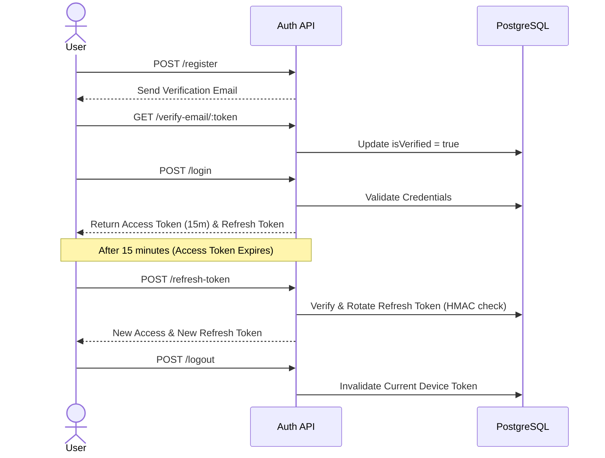
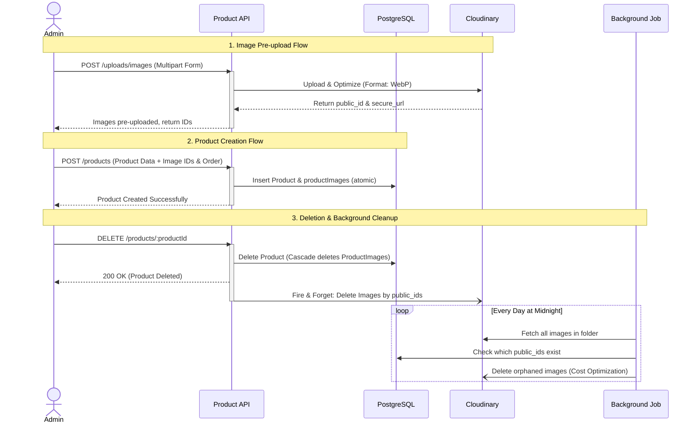
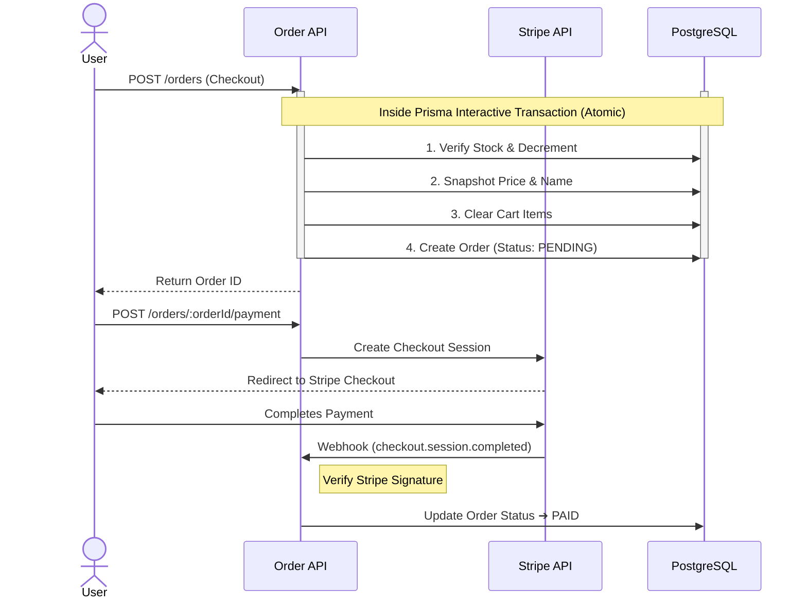

# E-Commerce Backend API

A production-aware RESTful backend for an e-commerce application, built with **Node.js**, **TypeScript**, **Express**, and **Prisma ORM** (PostgreSQL). Designed as a portfolio project to demonstrate professional backend engineering practices.

---

## Table of Contents

1. [Project Overview](#1-project-overview)
2. [Features](#2-features)
3. [Architecture Overview](#3-architecture-overview)
4. [Core Business Flows](#4-core-business-flows)
5. [API Endpoints](#5-api-endpoints)
6. [API Response Format](#6-api-response-format)
7. [Getting Started](#7-getting-started)
8. [Environment Variables](#8-environment-variables)
9. [Design Decisions](#9-design-decisions)
10. [Future Improvements](#10-future-improvements)
11. [Contact](#11-contact)

---

## 1. Project Overview

This project implements the core concerns of a real e-commerce backend system: stateless JWT authentication with refresh token rotation, role-based access control, a full product catalog with Cloudinary image management, cart and checkout flows with inventory control, Stripe Checkout integration with webhook handling, customer reviews with purchase verification, background cleanup jobs, and an analytics dashboard that aggregates app-wide revenue, customer behavior, and inventory health metrics in a single API call. The goal is to demonstrate a clean, modular, and production-aware codebase — not a toy CRUD app.

**Tech Stack:** Node.js · TypeScript · Express · Prisma ORM · PostgreSQL · Stripe · Cloudinary · Pino · Vitest · Docker

---

## 2. Features

- **Authentication** — JWT access tokens (short-lived) + opaque refresh tokens (long-lived, HMAC-SHA256 hashed before storage), with single-device and global logout support
- **Refresh token rotation** — each token can only be used once; replay a consumed token and the request is rejected
- **Session limiting** — configurable max concurrent sessions per user; oldest session is evicted on overflow
- **Role-based access control (RBAC)** — three roles (`USER`, `MANAGER`, `ADMIN`) with a centralized permission map
- **Modular Auth services** — `AuthService` decomposed into three focused services (`IdentityService`, `SessionService`, `PasswordService`) with a shared `TokenService` for cryptographic action-link generation; `SecurityUtils` centralises all SHA-256 / HMAC-SHA256 primitives
- **Email flows** — six transactional emails (welcome+verify, re-send verification, forgot password, invoice, order cancelled, password changed) delivered via a pluggable provider layer (Brevo / Mailtrap) with typed EJS templates; rendered and dispatched asynchronously by a dedicated **Email Worker** process
- **Event-driven architecture (EDA)** — domain services emit typed events via an in-process `EventBus` (Node.js `EventEmitter` singleton); four subscriber classes (`UserSubscriber`, `OrderSubscriber`, `PaymentSubscriber`, `ProductSubscriber`) translate events into BullMQ jobs, fully decoupling producers from consumers
- **BullMQ job queues** — five named queues (`EMAIL`, `IMAGE`, `ORDER`, `SCHEDULER`, `NOTIFICATION`) backed by Redis; a `QueueFactory` / `QueueRegistry` pair manages queue lifecycle; a `WorkerFactory` spawns BullMQ workers with configurable concurrency
- **Separate worker process** — `worker.server.ts` boots independently of the API; houses `EmailWorker`, `ImageWorker`, `OrderWorker`, and `SchedulerWorker`, each dispatching jobs via a strategy map (`IJobStrategy`)
- **Reliable background scheduler** — legacy `node-cron` jobs replaced by BullMQ repeatable jobs (`Queue.upsertJobScheduler`); five cleanup strategies (`carts`, `orders`, `orphan images`, `tokens`, `users`) run on cron schedules with automatic retry and observability
- **Bull Board UI** — queue dashboard mounted at `/admin/queues` (auth-protected); provides real-time visibility into job counts, retries, and failures across all queues
- **Product catalog** — filterable, sortable, paginated product listing; category hierarchy support; hidden product/category logic
- **Cloudinary image management** — multi-image upload per product (up to 3), ordered display, admin-only `publicId` exposure; image operations (upload, delete, bulk delete) offloaded to the `ImageWorker` via `ProductSubscriber`
- **Cart management** — per-user cart with quantity control and configurable item cap
- **Checkout (transactional)** — stock decrement, price/name snapshots, and cart clear run inside a single Prisma interactive transaction; rolls back atomically on any failure
- **Stripe Checkout** — Stripe Checkout Session creation for PENDING orders; webhook handler for `checkout.session.completed` marks orders as `PAID` and emits `PAYMENT_COMPLETED` (triggers invoice email via queue)
- **Order lifecycle** — status transitions (`PENDING → PAID → SHIPPED → DELIVERED`); expiration enforced by a delayed BullMQ job (10 min); shipping simulation runs as a scheduled worker strategy
- **Address snapshots** — shipping address captured at checkout time; historical accuracy preserved even if the user updates their address later
- **Purchase-verified reviews** — users can only review products from delivered orders; one review per user per product
- **Structured logging (Pino)** — JSON logs in production, pretty-printed in development; automatic `requestId` injection via `AsyncLocalStorage`; sensitive fields redacted at the logger configuration level
- **Integration test suite** — Vitest-based integration tests covering all modules, run against a dedicated Docker PostgreSQL instance
- **Dockerized** — separate `docker-compose` files for development, production, and testing; worker service defined in each compose file sharing the same Redis and PostgreSQL network
- **Analytics dashboard** — single `GET /stats` endpoint returning a complete application snapshot; all heavy aggregations run in parallel via `Promise.all`
  - **Financial metrics** — current/previous period revenue, order counts, period-over-period growth %, and average order value
  - **Product & inventory health** — best-selling products (by units sold), category revenue distribution, low-stock alerts (≤ 10 units), and dead-stock detection (products with no sales in 30+ days)
  - **Customer behavior** — new user count, repeat-customer rate, and period-over-period repeat-customer growth to distinguish loyal buyers from one-time purchasers
  - **Flexible time windows** — supports three preset intervals (`week`, `month`, `year`) and arbitrary custom `startDate`/`endDate` ranges validated via Zod

---

## 3. Architecture Overview

The application uses a **feature-based (modular) architecture**. Each feature domain is self-contained under `src/modules/`. There are no global `controllers/`, `services/`, or `repositories/` folders. A separate **worker process** (`worker.server.ts`) runs alongside the API, consuming BullMQ jobs from Redis-backed queues.

**Within each module:**

| File              | Responsibility                                                                |
| ----------------- | ----------------------------------------------------------------------------- |
| `*.routes.ts`     | Express router: maps HTTP verbs to controller methods and attaches middleware |
| `*.controller.ts` | Parses and validates the request, calls the service, sends the HTTP response  |
| `*.service.ts`    | All business logic for this domain                                            |
| `*.repo.ts`       | All Prisma/database queries for this domain                                   |
| `*.validator.ts`  | Zod schemas for request body, params, and query validation                    |
| `*.dto.ts`        | Response shape transformations (e.g., public view vs. admin view)             |
| `*.query.ts`      | Query engine config: allowed filters, sort fields, selectable fields          |

**Shared infrastructure** lives in `src/shared/` (email service, token service, security utils) and `src/infra/` (queue client, event bus, Cloudinary, email transport providers). `src/config/` holds validated env config, the database singleton, and the Pino logger.

```
src/
├── app.ts                      # Express app: middleware, route mounting, error handler
├── server.ts                   # API process entry: boots EventBus, queues, subscribers, Bull Board
├── config/
│   ├── env.ts                  # Env validation via Zod-style type guards (getConfig())
│   ├── database.ts             # PrismaClient singleton
│   └── logger.ts               # Pino base logger with redaction and AsyncLocalStorage mixin
├── infra/
│   ├── queue/                  # QueueClient (IORedis), QueueFactory, QueueRegistry, WorkerFactory
│   ├── event-bus/              # EventBus singleton (typed Node.js EventEmitter)
│   ├── email/                  # IEmailProvider, MailtrapProvider, BrevoProvider, EmailProviderFactory
│   └── cloudStorage/           # Cloudinary connection and upload helpers
├── shared/
│   ├── tokens/                 # TokenService, TokenRepo, ActionTokenType enum
│   ├── utils/                  # SecurityUtils (SHA-256, HMAC-SHA256, random token generation)
│   └── services/
│       └── email/              # EmailService + typed EJS templates (6 email types)
├── events/
│   ├── event.constants.ts      # EVENT_NAMES grouped by domain
│   ├── event.types.ts          # Typed payload interfaces per event
│   └── subscribers/            # UserSubscriber, OrderSubscriber, PaymentSubscriber, ProductSubscriber
├── workers/
│   ├── worker.server.ts        # Worker process entry point (separate from API)
│   ├── email/                  # EmailWorker + 6 strategy classes
│   ├── image/                  # ImageWorker + Upload/Delete/BulkDelete strategies
│   ├── order/                  # OrderWorker + ExpireOrder/SimulateShipping strategies
│   └── scheduler/              # SchedulerWorker + 5 cleanup strategies; Scheduler (repeatable jobs)
└── modules/
    ├── auth/
    │   └── services/
    │       ├── identity.service.ts   # Registration, email verification
    │       ├── session.service.ts    # Login, JWT, refresh rotation, logout
    │       └── password.service.ts   # Forgot/reset password, bcrypt
    ├── user/
    ├── product/
    ├── category/
    ├── cart/
    ├── order/
    ├── payment/
    ├── review/
    └── address/
```

---

### Request Lifecycle


## 4. Core Business Flows

### Authentication Flow



### Product Management & Media Lifecycle (Admin)

Demonstrates separated media uploads, Cloudinary optimization (WebP), fire-and-forget deletion, and a background cron job to sweep orphaned images for cost optimization.



### Checkout & Payment Flow



If any step in the checkout transaction fails, the entire operation rolls back — no stock is decremented, no order is created.

If order status is `PENDING` for more than 10 minutes and user did not complete the checkout, a cron job cancels the order and restores stock.

---

## 5. API Endpoints

> This is a representative selection, not an exhaustive list.

### Auth

| Method | Endpoint                             | Description                                           |
| ------ | ------------------------------------ | ----------------------------------------------------- |
| `POST` | `/api/v1/auth/register`              | Create account; sends verification email              |
| `POST` | `/api/v1/auth/login`                 | Validate credentials; returns access + refresh tokens |
| `POST` | `/api/v1/auth/refresh-token`         | Rotate refresh token; old token is invalidated        |
| `POST` | `/api/v1/auth/logout`                | Invalidate current device's refresh token             |
| `POST` | `/api/v1/auth/logout-all`            | Invalidate all sessions for the current user          |
| `GET`  | `/api/v1/auth/verify-email/:token`   | Verify email address                                  |
| `POST` | `/api/v1/auth/forgot-password`       | Send password reset email                             |
| `POST` | `/api/v1/auth/reset-password/:token` | Set new password via reset token                      |

### Products

| Method   | Endpoint                            | Description                                                             |
| -------- | ----------------------------------- | ----------------------------------------------------------------------- |
| `GET`    | `/api/v1/products`                  | Paginated, filterable product list (price, name, rating, category slug) |
| `GET`    | `/api/v1/products/:id`              | Full product detail with images and recent reviews                      |
| `POST`   | `/api/v1/products`                  | Manager/Admin: create product with pre-uploaded images                  |
| `PATCH`  | `/api/v1/products/:id`              | Manager/Admin: update product fields or replace image set               |
| `DELETE` | `/api/v1/products/:id`              | Manager/Admin: delete product and fire background Cloudinary cleanup    |
| `POST`   | `/api/v1/products/images/upload`    | Manager/Admin: upload 1–3 images to Cloudinary                          |
| `DELETE` | `/api/v1/products/images/:publicId` | Manager/Admin: delete a single image from Cloudinary                    |

### Orders & Payments

| Method | Endpoint                          | Description                                               |
| ------ | --------------------------------- | --------------------------------------------------------- |
| `POST` | `/api/v1/orders`                  | Checkout: transactional stock check, snapshot, cart clear |
| `GET`  | `/api/v1/orders`                  | Authenticated user's order history                        |
| `GET`  | `/api/v1/orders/:id`              | Single order with items and snapshots                     |
| `POST` | `/api/v1/orders/:orderId/payment` | Create Stripe Checkout Session for a pending order        |
| `POST` | `/api/v1/payments/webhook`        | Stripe webhook receiver (raw body, signature verified)    |

### Other Modules

| Method   | Endpoint                              | Description                                            |
| -------- | ------------------------------------- | ------------------------------------------------------ |
| `GET`    | `/api/v1/users/me`                    | Authenticated user profile                             |
| `PATCH`  | `/api/v1/users/me`                    | Update name or password                                |
| `DELETE` | `/api/v1/users/me`                    | Soft-delete own account (purged by cron after 30 days) |
| `GET`    | `/api/v1/categories`                  | Full category list                                     |
| `GET`    | `/api/v1/cart`                        | User's cart with current prices                        |
| `POST`   | `/api/v1/cart/items`                  | Add item to cart                                       |
| `POST`   | `/api/v1/products/:productId/reviews` | Submit review (requires completed order)               |
| `GET`    | `/api/v1/users/me/address`            | Saved shipping addresses                               |

### Dashboard (Admin / Manager)

| Method | Endpoint                        | Description                                                                                                                         |
| ------ | ------------------------------- | ----------------------------------------------------------------------------------------------------------------------------------- |
| `GET`  | `/api/v1/admin/dashboard/stats` | Full application snapshot: revenue, orders, best sellers, category distribution, customer behavior, low-stock and dead-stock alerts |

**Query parameters (one of the following is required):**

| Parameter   | Type     | Example                     | Description                                   |
| ----------- | -------- | --------------------------- | --------------------------------------------- |
| `period`    | `string` | `week` \| `month` \| `year` | Preset interval relative to today             |
| `startDate` | `date`   | `2024-01-01`                | Start of a custom range (pair with `endDate`) |
| `endDate`   | `date`   | `2024-03-31`                | End of a custom range (pair with `startDate`) |

**Response shape:**

```json
{
  "status": "success",
  "data": {
    "summary": {
      "revenue": { "current": 0, "previous": 0, "growth": null },
      "orders": { "current": 0, "previous": 0, "growth": null },
      "avgOrderValue": 0,
      "newUsers": 0,
      "repeatCustomers": {
        "current": 0,
        "previous": 0,
        "rate": 0,
        "growth": null,
        "isReliable": false
      },
      "highlights": { "topCategory": null, "topProduct": null, "bestDay": null }
    },
    "charts": {
      "salesOverTime": [
        { "date": "2024-01-01", "revenue": 0, "orderCount": 0 }
      ],
      "categoryDistribution": [
        { "category": "Electronics", "count": 0, "revenue": 0 }
      ],
      "bestSellers": [
        { "id": "", "name": "", "price": 0, "totalSold": 0, "revenue": 0 }
      ],
      "orderStatus": [{ "status": "PAID", "count": 0, "revenue": 0 }]
    },
    "alerts": {
      "outOfStockRate": 0,
      "lowStock": [{ "id": "", "name": "", "stock": 0, "price": 0 }],
      "deadStock": [
        { "id": "", "name": "", "stock": 0, "price": 0, "daysWithoutSales": 0 }
      ]
    }
  }
}
```

---

## 6. API Response Format

All endpoints follow a consistent response shape.

**Success:**

```json
{
  "status": "success",
  "data": {}
}
```

**Success (Paginated):**

```json
{
  "status": "success",
  "results": 20,
  "pagination": {
    "totalItems": 100,
    "totalPages": 5,
    "currentPage": 1,
    "nextPage": 2,
    "prevPage": null,
    "limit": 20
  },
  "data": {}
}
```

**Client error (4xx):**

```json
{
  "status": "fail",
  "message": "Descriptive error message"
}
```

**Server error — Development:**

```json
{
  "status": "error",
  "message": "Detailed error message",
  "stack": "Error: ...\n    at ...",
  "error": {}
}
```

**Server error — Production:**

```json
{
  "status": "error",
  "message": "Something went wrong"
}
```

Stack traces are only included in development. In production, non-operational errors (unexpected exceptions) are logged server-side via Pino and a generic message is returned to the client. Operational errors (expected `AppError` instances like 404 or 403) always return their specific message regardless of environment.

Prisma errors are intercepted and mapped to appropriate HTTP responses — for example, `P2002` (unique constraint) becomes a `409 Conflict` with a field name, and `P2025` (record not found) becomes a `404`.

---

## 7. Getting Started

### Prerequisites

- Node.js >= 18
- PostgreSQL >= 14, or use the Docker Compose setup
- A Cloudinary account (free tier is sufficient)
- A Stripe account (test mode keys)

### Local Development

```bash
# Clone the repository
git clone https://github.com/Omar3597/ecommerce.git
cd ecommerce

# Install dependencies
npm install

# Copy the example env file and fill in your values
cp .env.example .env

# Apply the schema to your database
npx prisma db push

# (Optional) Seed development data
npm run db:seed:dev

# Start the dev server with hot reload
npm run dev
```

The API will be available at `http://localhost:3000/api/v1`.

### Docker Compose (Recommended)

```bash
# Start the app and a PostgreSQL container
docker compose -f docker-compose.dev.yml up --build

# In a separate terminal, apply migrations inside the running container
docker compose -f docker-compose.dev.yml exec app npx prisma migrate deploy
```

The API will be available at `http://localhost:3000/api/v1`.

### Running Integration Tests

```bash
# Runs all integration tests inside a dedicated Docker environment
npm run test
```

Tests use a separate PostgreSQL container defined in `docker-compose.test.yml` and the `.env.test` configuration. The test suite covers all 9 modules (auth, user, product, category, cart, order, payment, review, address).

---

## 8. Environment Variables

| Variable                      | Description                                           |
| ----------------------------- | ----------------------------------------------------- |
| `DATABASE_URL`                | PostgreSQL connection string                          |
| `JWT_SECRET`                  | Secret for signing JWT access tokens                  |
| `REFRESH_TOKEN_SECRET`        | HMAC key for hashing refresh tokens before DB storage |
| `MAX_ACTIVE_SESSIONS`         | Max concurrent refresh tokens (sessions) per user     |
| `MAX_CART_QUANTITY`           | Max quantity per cart item                            |
| `CLOUDINARY_CLOUD_NAME`       | Cloudinary cloud name                                 |
| `CLOUDINARY_API_KEY`          | Cloudinary API key                                    |
| `CLOUDINARY_API_SECRET`       | Cloudinary API secret                                 |
| `STRIPE_SECRET_KEY`           | Stripe secret key (`sk_test_...` for test mode)       |
| `STRIPE_WEBHOOK_SECRET`       | Stripe webhook signing secret (`whsec_...`)           |
| `STRIPE_SUCCESS_URL`          | Redirect URL after successful Stripe payment          |
| `STRIPE_CANCEL_URL`           | Redirect URL if user cancels Stripe Checkout          |
| `MAIL_HOST` / `MAIL_PORT`     | SMTP server configuration                             |
| `MAIL_USER` / `MAIL_PASSWORD` | SMTP credentials                                      |
| `BASE_URL`                    | Server base URL (used in email links)                 |

See `.env.example` for the full reference.

---

## 9. Design Decisions

**JWT access tokens + opaque refresh tokens with HMAC storage**

Short-lived JWTs (15 minutes) minimize damage from token leakage — no database lookup is required to verify them. Refresh tokens are long-lived but stored only as HMAC-SHA256 hashes in the database; the raw token is never persisted. If the database is compromised, the attacker cannot use the stored values to authenticate. Rotation ensures each token is single-use, which eliminates replay attacks on previously rotated tokens.

**Auth module decomposition — three focused services + shared `TokenService`**

The original monolithic `AuthService` was split into `IdentityService` (registration, verification), `SessionService` (login, JWT, refresh rotation, logout), and `PasswordService` (forgot/reset password). All cryptographic primitives (SHA-256, HMAC-SHA256, random token generation) are centralised in a stateless `SecurityUtils` singleton imported directly wherever needed — no constructor injection overhead. Token generation and URL-building live in a shared `TokenService` / `TokenRepo` pair (`src/shared/tokens/`), decoupling action-link issuance from the Auth domain entirely. This means any future module can issue short-lived action URLs without touching Auth. The timing-attack dummy `bcrypt.compare` and anti-enumeration silent return are explicitly preserved in `SessionService` and `PasswordService` respectively.

**Event-driven architecture with an in-process EventBus**

Domain services (`AuthService`, `OrderService`, `PaymentService`, `ProductService`) emit typed events via a singleton `EventBus` (Node.js `EventEmitter`). Subscriber classes listen to these events and enqueue BullMQ jobs — they are the only coupling point between producers and consumers. This keeps service methods free of email/image/queue logic and makes adding new side-effects (e.g., push notifications) a matter of adding a subscriber, not touching existing services.

**Separate worker process with strategy-pattern job dispatch**

Workers run in an independent Node.js process (`worker.server.ts`), completely decoupled from the HTTP API. Each worker holds a `Map<jobName, IJobStrategy>` and delegates `job.name` lookup at runtime. Adding a new job type requires only a new strategy class and a map entry — no modification to the worker core. The worker process handles graceful shutdown (`SIGTERM`/`SIGINT`): it closes all BullMQ workers, disconnects Redis, and disconnects Prisma before exiting.

**BullMQ repeatable jobs replace node-cron**

All scheduled cleanup tasks (expired tokens, stale carts, soft-deleted users, abandoned orders, orphaned Cloudinary images) are now registered as BullMQ repeatable jobs via `Queue.upsertJobScheduler()`. Unlike in-process cron, BullMQ jobs survive server restarts, support automatic retries, and are visible in the Bull Board UI. The scheduler registration is idempotent — the same cron expression is safe to re-register on every worker boot.

**Layered email service with pluggable providers**

Email delivery is split into three layers: an infrastructure transport layer (`IEmailProvider` with `MailtrapProvider` and `BrevoProvider`), a business logic layer (`EmailService` with six typed methods and EJS templates), and an execution layer (six `IEmailStrategy` classes inside `EmailWorker`). `EmailProviderFactory.create()` reads `EMAIL_PROVIDER` from env and returns the correct transport. Switching providers requires only an env change — no code change.

**Feature-based modular architecture**

Grouping files by domain rather than by technical layer (e.g., all controllers in one folder) keeps related code co-located. When working on the `payment` feature, everything relevant — routes, controller, service, repository, validator — is in `src/modules/payment/`. This reduces cross-file navigation and makes the impact of a change easier to reason about.

**Transactional checkout with Prisma interactive transactions**

The checkout flow — stock decrement, snapshot capture, order creation, cart clear — is wrapped in a single `prisma.$transaction()`. This guarantees that either all operations succeed or none do. There is no intermediate state where stock is decremented but the order has not been created, or the cart is cleared before the order is confirmed.

**Price and name snapshots on order items**

Each `OrderItem` stores `price` and `name` from the product at the time of purchase via a separate `OrderedProductSnapshot` table. This keeps historical order records accurate regardless of future product changes or deletions. The trade-off is a small amount of data duplication.

**Pino for structured logging with request correlation**

`AsyncLocalStorage` is used to propagate a `requestId` (UUID generated per request) through the entire request lifecycle without passing it through function signatures. Every log line emitted during a request automatically includes the `requestId`, which makes filtering log streams by request straightforward. Sensitive fields (passwords, tokens, emails) are redacted at the logger configuration level, not at individual call sites.

**Address snapshot at checkout**

When a user places an order, the selected shipping address is copied into a separate `OrderAddressSnapshot` record. This preserves the exact delivery details at the time of purchase, independent of any future edits to the user's address book.

**Raw SQL for dashboard aggregations (`$queryRaw`)**

The dashboard's analytical queries — `DATE_TRUNC` for time-bucket grouping, `COALESCE(MAX(...))` for dead-stock detection, CTEs for repeat-customer classification — cannot be expressed efficiently through Prisma's typed query builder. `$queryRaw` with `Prisma.sql` tagged templates is used instead. This allows leveraging the full power of SQL for complex aggregations while still benefiting from Prisma's connection management and transaction support.

---

## 10. Future Improvements

- **Redis caching for catalog queries** — `GET /api/v1/products` hits the database on every request. A short-TTL Redis cache would reduce database load under real traffic.
- **Redis caching for dashboard stats** — The dashboard's nine parallel aggregation queries are compute-heavy. A short-TTL Redis cache (e.g. 5 minutes) keyed by interval would make repeated dashboard loads near-instant and drastically reduce database pressure during peak admin usage.
- **Per-user rate limiting on authenticated routes** — The current rate limiter is IP-based. Authenticated routes should additionally enforce limits keyed by user ID to handle shared-IP scenarios (e.g., corporate networks).
- **Cursor-based pagination** — The current product list uses offset pagination (`skip`/`take`). Cursor-based pagination is more stable for large, frequently updated catalogs.
- **Unit test coverage** — The existing suite covers integration-level behavior. Unit tests for the new service classes (`IdentityService`, `SessionService`, `PasswordService`, `TokenService`) and worker strategies would add a valuable safety net for future refactoring.
- **BullMQ job observability & alerting** — Integrate dead-letter queue handling and alerting (e.g., Slack webhook on repeated job failures) to make the worker process production-ready beyond Bull Board.
- **Email change flow** — Add a user-initiated email-change confirmation flow using the existing `TokenService` infrastructure: emit a `USER_REQUEST_EMAIL_CHANGE` event, enqueue a confirmation email via `UserSubscriber`, and verify the new address via a `ChangeEmailStrategy` in `EmailWorker`.
- **Downloadable analytics reports** — Allow admins to export the dashboard data as CSV or PDF files for offline reporting and stakeholder sharing.

---

## 11. Contact

- **GitHub**: [github.com/Omar3597](https://github.com/Omar3597)
- **Email**: [omar.elgouhary.dev@gmail.com](mailto:omar.elgouhary.dev@gmail.com)